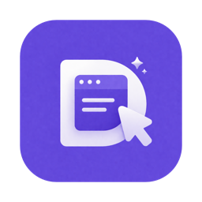

<p align="center">
  
</p>

<h1 align="center">DOMPrompter</h1>

<p align="center">
  <strong>Visual Bridge Between You and AI Code Editors</strong>
  <br>
  Show AI exactly what you want to change
  <br>
  <a href="https://hooosberg.github.io/DOMPrompter/">Website</a>
</p>

<p align="center">
  <a href="README.md">English</a> |
  <a href="i18n/README_zh.md">简体中文</a> |
  <a href="i18n/README_ja.md">日本語</a> |
  <a href="i18n/README_ko.md">한국어</a> |
  <a href="i18n/README_es.md">Español</a> |
  <a href="i18n/README_fr.md">Français</a> |
  <a href="i18n/README_de.md">Deutsch</a>
</p>

<p align="center">
  <a href="LICENSE"></a>
  
  
  
  
  
</p>

<p align="center">
  <a href="https://apps.apple.com/app/id6761685716"></a>
</p>

---

**DOMPrompter** is a macOS desktop app that lets you visually select elements, tweak CSS properties, and generate structured AI prompts — so tools like **Cursor**, **Claude Code**, **Codex**, and more can modify your source code accurately.

---

## The Problem

When fine-tuning a webpage with AI, screenshots never capture the right element. AI can't pinpoint *"which element needs what change"*. You end up going back and forth, describing layout tweaks in words that get lost in translation.

**DOMPrompter solves this** — precise selection + precise description = precise code changes.

---

## How It Works

| Step | Description |
|:----:|:------------|
| **1** | **Select** — Click any element on your page to highlight it with a precise CSS selector |
| **2** | **Tweak** — Adjust CSS properties (width, height, padding, margin) visually in real time |
| **3** | **Annotate** — Add text tags describing what you want ("button too dark", "spacing too wide") |
| **4** | **Generate** — DOMPrompter merges selector + style diffs + annotations into a structured AI prompt |
| **5** | **Hand Off** — Paste into Cursor, Claude Code, Codex or any AI assistant for accurate code changes |

---

## Key Features

- **Precise Element Selection** — Click-to-select with CSS selector auto-identification
- **Style Diff Tracking** — Every change recorded as before/after diff (e.g., `width: 200px → 300px`)
- **Natural Language Tags** — Tag elements with notes so AI understands your design intent
- **Instant Feedback** — Floating action buttons modify DOM directly, WYSIWYG
- **Undo & Redo** — Full operation history with `Cmd+Z` / `Cmd+Shift+Z`
- **Local-First** — No data collection, everything stays on your device

---

## Architecture

```
┌──────────────────────────────────┐
│   Target Page (Browser)          │
│   └─ Injected Overlay Layer      │
│      ├─ Selection highlight      │
│      ├─ Floating action buttons  │
│      └─ Tag badges               │
└──────────┬───────────────────────┘
           │ Chrome DevTools Protocol
           ▼
┌──────────────────────────────────┐
│   Core Engine                    │
│   ├─ CDP Client                  │
│   ├─ Inspector Service           │
│   └─ Element Details Resolver    │
└──────────┬───────────────────────┘
           │ Electron IPC
           ▼
┌──────────────────────────────────┐
│   App UI (React)                 │
│   ├─ Properties Workbench        │
│   ├─ Style Binding & Undo/Redo  │
│   └─ Prompt Generator            │
└──────────────────────────────────┘
```

---

## Works With

DOMPrompter generates prompts compatible with any AI coding assistant:

**Claude Code** · **Cursor** · **Codex** · **Windsurf** · **GitHub Copilot** · **Gemini** · **Cline** · **Trae** · **AmpCode** · **Kiro** · **Roo Code** · and more

---

## Links

- [Website](https://hooosberg.github.io/DOMPrompter/)
- [Support Center](https://hooosberg.github.io/DOMPrompter/pages/support.html)
- [Privacy Policy](https://hooosberg.github.io/DOMPrompter/pages/privacy.html)
- [Terms of Service](https://hooosberg.github.io/DOMPrompter/pages/terms.html)

---

## Sibling projects

Built by [hooosberg](https://github.com/hooosberg):

- [AgentLimb](https://agentlimb.com) — teach AI to control your browser
- [BeRaw](https://hooosberg.github.io/BeRaw/) — Behance raw-image grabber
- [Packpour](https://hooosberg.github.io/Packpour/) — App Store Connect locale filler
- [WitNote](https://hooosberg.github.io/WitNote/) — local-first AI writing companion
- [GlotShot](https://hooosberg.github.io/GlotShot/) — perfect App Store preview images
- [TrekReel](https://hooosberg.github.io/TrekReel/) — outdoor trails, cinematic reels
- [UIXskills](https://uixskills.com) — AI → JSON → Whiteboard → UI

---

## License

All rights reserved. &copy; 2026 DOMPrompter.
