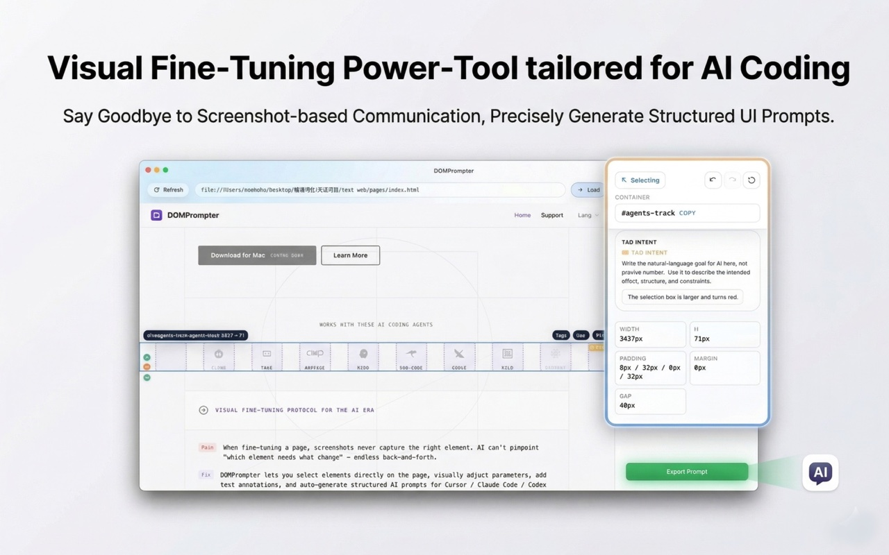

<p align="center">
  
</p>

<h1 align="center">DOMPrompter</h1>

<p align="center">
  <strong>Show AI exactly what to change — down to the pixel.</strong><br>
  The macOS visual bridge between your browser and any AI code editor — click an element, tweak its style, generate a prompt Cursor / Claude Code / Codex can execute.
</p>

<p align="center">
  <a href="https://apps.apple.com/app/id6761685716">
    
  </a>
  <a href="https://hooosberg.github.io/DOMPrompter/">
    
  </a>
  <a href="https://github.com/hooosberg/DOMPrompter">
    
  </a>
</p>

<p align="center">
  <em>If DOMPrompter cuts your back-and-forth with AI editors, please ⭐ star this repo — it helps other vibe-coders find it.</em>
</p>

<p align="center">
  <a href="LICENSE"></a>
  
  
  
  
  
  
</p>

<p align="center">
  <strong>
    English &nbsp;|&nbsp;
    <a href="./i18n/README_zh.md">简体中文</a> &nbsp;|&nbsp;
    <a href="./i18n/README_ja.md">日本語</a> &nbsp;|&nbsp;
    <a href="./i18n/README_ko.md">한국어</a> &nbsp;|&nbsp;
    <a href="./i18n/README_es.md">Español</a> &nbsp;|&nbsp;
    <a href="./i18n/README_fr.md">Français</a> &nbsp;|&nbsp;
    <a href="./i18n/README_de.md">Deutsch</a>
  </strong>
</p>

<p align="center">
  
</p>

---

## About

**DOMPrompter** is a macOS desktop app that turns any webpage element into a ready-to-run AI coding prompt. Click an element, tweak its CSS visually, drop in a plain-language annotation — DOMPrompter packages the exact selector + style diff + intent into a single prompt that Cursor, Claude Code, Codex, Windsurf, or any AI coding assistant can execute without guessing.

Screenshots don't tell AI *which* element. Words don't tell AI *how much*. DOMPrompter tells it both — precisely.

## The Problem It Solves

When fine-tuning a page with AI, the loop usually looks like this:

1. You take a screenshot
2. AI guesses which element you meant, often wrong
3. You describe the change in words ("make it tighter, the one on the right…")
4. AI over-corrects or mis-targets — you try again
5. Repeat

DOMPrompter cuts the loop to one pass: **precise selection + precise style diff + plain-language intent = precise code change**, first try.

## Highlights

### 1. Click-to-Select with Real Selectors

Click any element inside the embedded browser. DOMPrompter captures the live CSS selector, the computed style, and the node's position in the DOM. The AI gets the exact target — no "the third card from the left" guessing.

### 2. Tweak Styles Visually, Track the Diff

Adjust width / height / padding / margin / color / font in a properties panel. Every change is recorded as a before/after diff (`width: 200px → 300px`). The prompt you send carries the diff, not a vague "make it bigger".

### 3. Natural-Language Annotation Tags

Drop text tags on elements — "button too dark", "spacing too wide", "make this feel premium". Tags ride alongside the style diff so the AI understands both *what* you changed and *why*.

### 4. Prompt Generator — One Click, Everywhere

DOMPrompter merges selector + style diff + annotations + surrounding context into a structured prompt optimized for code-editing AIs. Copy to clipboard, paste into Cursor / Claude Code / Codex / Windsurf / Copilot / Gemini / Cline / Trae / AmpCode / Kiro / Roo Code — the prompt is model-agnostic.

### 5. Undo / Redo with Full History

`Cmd+Z` / `Cmd+Shift+Z` through every style change and annotation. Experiment freely; nothing is committed to your source until the AI applies the generated prompt.

### 6. 100% Local

DOMPrompter runs entirely on your Mac. No cloud relay, no telemetry, no account. Your pages, selectors, and prompts never leave your device.

## How It Works

```
Target webpage (embedded Chromium)
    ↕  Chrome DevTools Protocol — live selectors, computed styles, DOM paths
DOMPrompter Core Engine
    ├─ CDP Client
    ├─ Inspector Service
    └─ Element Details Resolver
    ↕  Electron IPC
DOMPrompter App (React UI)
    ├─ Properties Workbench — visual style tweaks, recorded as diffs
    ├─ Style Binding & Undo/Redo — full history
    └─ Prompt Generator — selector + diff + annotations → AI prompt
    ↓  copy to clipboard
Any AI code editor (Cursor / Claude Code / Codex / Windsurf / Copilot / …)
    ↓  paste → apply
Your source code — pixel-precise change, first try
```

## Quick Start

1. **Install** — [Download from the Mac App Store](https://apps.apple.com/app/id6761685716) (Apple Silicon M1–M5).
2. **Open your local site** — Paste a `localhost:3000` / `127.0.0.1` URL into DOMPrompter's address bar (or open a staging URL).
3. **Select + tweak** — Click an element, adjust styles in the Properties panel, drop an annotation tag.
4. **Generate + paste** — Click **Generate Prompt**, paste into Cursor / Claude Code / Codex / your AI of choice. Done.

## Works With

DOMPrompter's generated prompts are compatible with every major AI coding assistant:

**Claude Code** · **Cursor** · **Codex** · **Windsurf** · **GitHub Copilot** · **Gemini** · **Cline** · **Trae** · **AmpCode** · **Kiro** · **Roo Code** · and anything else that takes a text prompt.

## Why Not Just Screenshot + Describe?

| | Screenshot + description | Browser DevTools → copy selector | Generic "fix this CSS" prompt | **DOMPrompter** |
|---|---|---|---|---|
| **Element targeting** | AI guesses from pixels | Manual copy each time | No targeting at all | Live CSS selector captured on click |
| **Style change intent** | Vague words | You diff by hand | Vague words | Before/after style diff auto-recorded |
| **Context** | Just the cropped image | Selector only | Just the free-form prompt | Selector + diff + annotation + DOM path |
| **Iteration speed** | High — many back-and-forths | Medium — manual every round | High — vague → wrong → retry | Low — one pass often lands |
| **AI compatibility** | Any (but noisy) | Any (but incomplete) | Any (but imprecise) | Any (optimized payload) |
| **Local-first** | — | — | — | ✅ 100% local |

**What makes DOMPrompter unique:** it's the only tool that captures *selector + visual diff + intent* in one structured payload, ready for any AI editor. No screenshots to interpret, no manual selector copying, no vague prose.

## Use Cases

- **Design polish** — "this card feels heavy" → exact padding/shadow diff → AI tightens it in code
- **Responsive tweaks** — live-adjust at a breakpoint, send the diff to AI, skip the manual media-query hunt
- **Onboarding a new codebase** — click the element, let DOMPrompter show you its selector chain + computed styles
- **AI pair programming** — give Cursor / Claude Code a precise payload every time you reach into visual design

## Resources

- **Website**: [hooosberg.github.io/DOMPrompter](https://hooosberg.github.io/DOMPrompter/)
- **Mac App Store**: [Download DOMPrompter](https://apps.apple.com/app/id6761685716)
- **Support**: [Support Center](https://hooosberg.github.io/DOMPrompter/pages/support.html)
- **Privacy Policy**: [Privacy Policy](https://hooosberg.github.io/DOMPrompter/pages/privacy.html)
- **Terms of Service**: [Terms of Service](https://hooosberg.github.io/DOMPrompter/pages/terms.html)

## Contact

- **GitHub**: [hooosberg/DOMPrompter](https://github.com/hooosberg/DOMPrompter)
- **Email**: [zikedece@proton.me](mailto:zikedece@proton.me)

## Sibling projects

Built by [hooosberg](https://github.com/hooosberg):

- [AgentLimb](https://agentlimb.com) — teach AI to control your browser
- [BeRaw](https://hooosberg.github.io/BeRaw/) — Behance raw-image grabber
- [Packpour](https://hooosberg.github.io/Packpour/) — App Store Connect locale filler
- [WitNote](https://hooosberg.github.io/WitNote/) — local-first AI writing companion
- [GlotShot](https://hooosberg.github.io/GlotShot/) — perfect App Store preview images
- [TrekReel](https://hooosberg.github.io/TrekReel/) — outdoor trails, cinematic reels
- [UIXskills](https://uixskills.com) — AI → JSON → Whiteboard → UI

## License

All rights reserved. Copyright © 2026 DOMPrompter.
